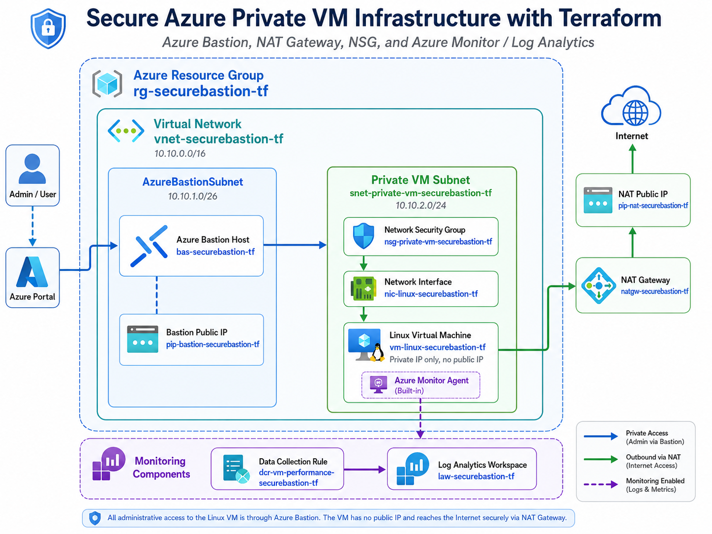
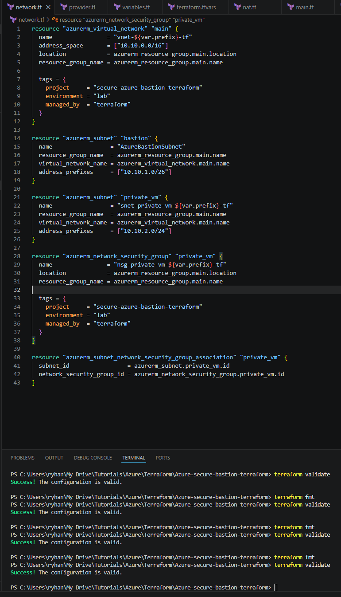
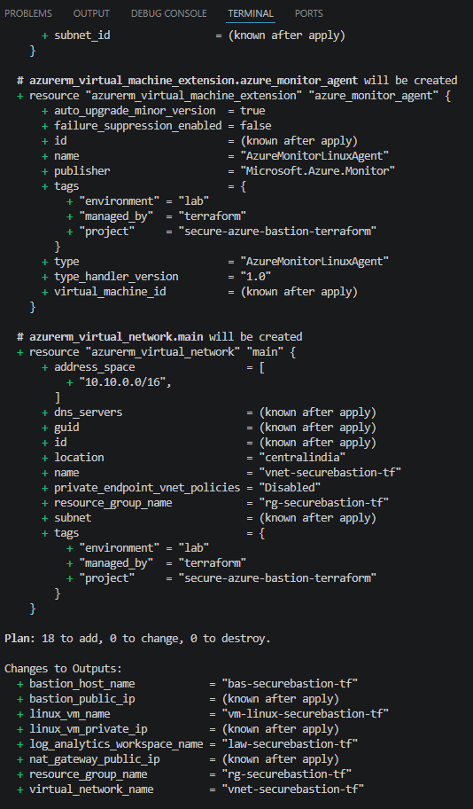
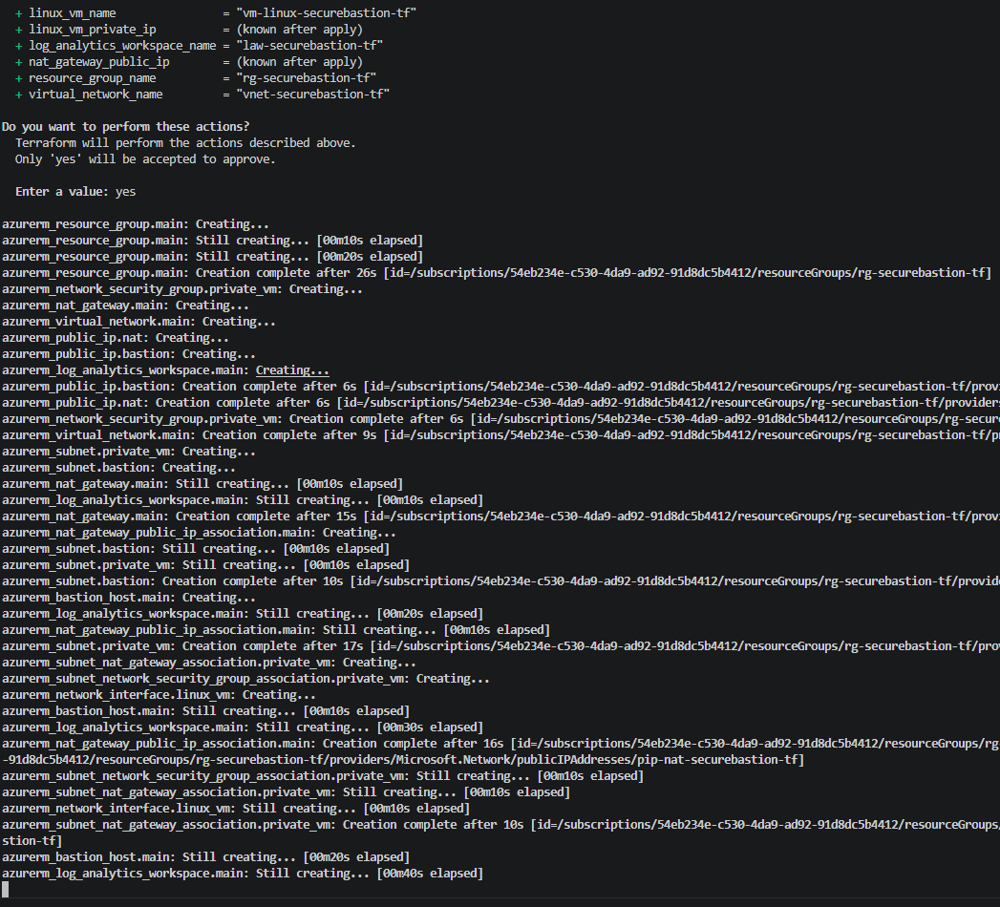
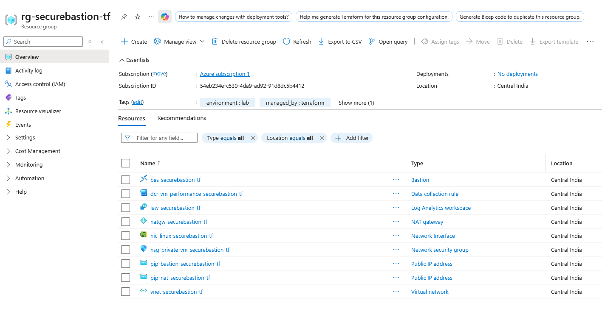
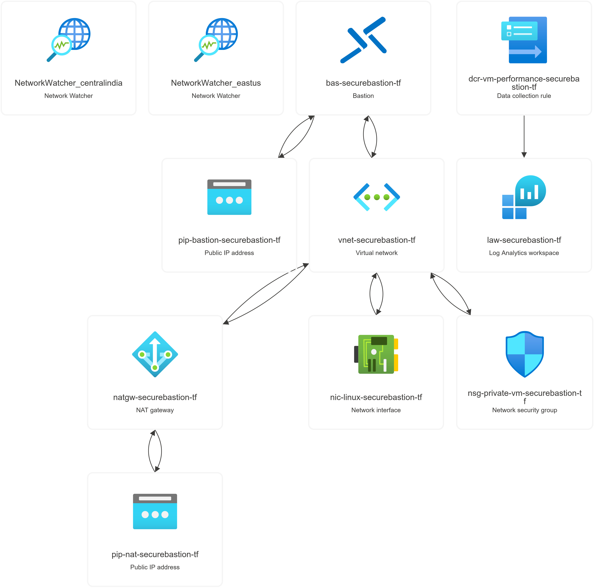
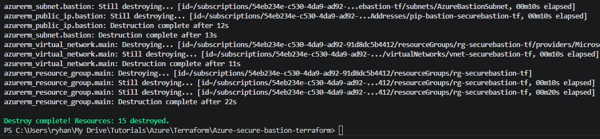

# Secure Azure Private VM Infrastructure with Terraform

## Project Overview

This project deploys a secure Azure infrastructure using Terraform. The design focuses on private VM access, controlled outbound connectivity, and basic monitoring.

The Linux virtual machine is deployed without a public IP address. Administrative access is provided through Azure Bastion, while outbound internet connectivity is handled through Azure NAT Gateway. Azure Monitor and Log Analytics are included for basic infrastructure monitoring.

## Architecture



## Azure Services Used

- Azure Resource Group
- Azure Virtual Network
- Azure Subnets
- Azure Bastion
- Azure NAT Gateway
- Azure Public IP
- Azure Linux Virtual Machine
- Azure Network Interface
- Azure Network Security Group
- Azure Monitor
- Log Analytics Workspace
- Data Collection Rule
- Azure Monitor Agent

## Terraform Files

| File | Purpose |
|---|---|
| `provider.tf` | Configures the AzureRM Terraform provider |
| `variables.tf` | Defines reusable input variables |
| `main.tf` | Creates the Azure Resource Group |
| `network.tf` | Creates the VNet, subnets, NSG, and NSG association |
| `nat.tf` | Creates NAT Gateway, NAT public IP, and subnet association |
| `bastion.tf` | Creates Azure Bastion and Bastion public IP |
| `vm.tf` | Creates the private Linux VM and network interface |
| `monitoring.tf` | Creates Log Analytics, Data Collection Rule, and Azure Monitor Agent |
| `outputs.tf` | Displays useful output values after deployment |
| `terraform.tfvars.example` | Example variable values for deployment |

## Prerequisites

- Azure subscription
- Terraform installed
- Azure CLI installed
- SSH key pair available locally
- Azure CLI authenticated to the correct subscription

Check Azure CLI login:

```powershell
az login
az account show -o table
```

Check Terraform:

```powershell
terraform -version
```

## Deployment Steps

Clone the repository or open the project folder.

Create your own `terraform.tfvars` file using the example file:

```powershell
copy terraform.tfvars.example terraform.tfvars
```

Update `terraform.tfvars` with your own Azure subscription ID:

```hcl
subscription_id      = "your-subscription-id"
prefix               = "securebastion"
location             = "Central India"
admin_username       = "azureuser"
ssh_public_key_path  = "~/.ssh/id_rsa.pub"
```

Initialize Terraform:

```powershell
terraform init
```

Format and validate the configuration:

```powershell
terraform fmt
terraform validate
```

Review the execution plan:

```powershell
terraform plan
```

Apply the configuration:

```powershell
terraform apply
```

Type `yes` when prompted.

## Validation and Testing

After deployment, validate the following:

1. The Linux VM has no public IP address.
2. Azure Bastion is deployed in `AzureBastionSubnet`.
3. The private VM can be accessed through Azure Bastion.
4. NAT Gateway provides outbound internet access for the private subnet.
5. Log Analytics Workspace and Data Collection Rule are created.
6. Terraform outputs show the resource group, VNet, VM private IP, NAT public IP, and Bastion public IP.

Example command to test outbound internet from the private VM:

```bash
curl ifconfig.me
```

The returned IP should match the NAT Gateway public IP.

## Screenshots

### Terraform Validation



### Terraform Plan



### Terraform Apply Progress



### Azure Resources



### Azure Resource Visualizer



### Terraform Destroy



## Troubleshooting

### VM SKU Not Available

During deployment, Azure may return an error similar to:

```text
SkuNotAvailable: Standard_B1s is currently not available in location CentralIndia.
```

This means the selected VM size is temporarily unavailable in the selected region.

Possible fixes:

- Change the VM size in `vm.tf`
- Try another Azure region
- Try another available VM SKU

Example replacement:

```hcl
size = "Standard_B1ms"
```

or:

```hcl
size = "Standard_B2s"
```

After updating the VM size, run:

```powershell
terraform fmt
terraform validate
terraform plan
terraform apply
```

### Azure Bastion Takes Time to Deploy

Azure Bastion can take several minutes to provision. Terraform may show:

```text
azurerm_bastion_host.main: Still creating...
```

This is normal and does not necessarily indicate an error.

### Partial Deployment After Failure

If one resource fails, Terraform may still create other resources successfully. After fixing the issue, run:

```powershell
terraform plan
terraform apply
```

Terraform will continue from the current state and create only the missing resources.

### Cost Control

Azure Bastion, NAT Gateway, public IP addresses, virtual machines, disks, and Log Analytics can generate cost.

Destroy the resources after testing:

```powershell
terraform destroy
```

Type `yes` when prompted.

## Cleanup

To delete all resources created by this project:

```powershell
terraform destroy
```

Verify in Azure Portal that the resource group and related resources are removed.

## Security Notes

- The Linux VM is deployed without a public IP address.
- SSH access is not exposed directly to the internet.
- Azure Bastion is used for secure administrative access.
- NAT Gateway is used for outbound internet connectivity.
- Terraform state files are excluded from GitHub because they may contain infrastructure metadata.

## Skills Demonstrated

- Infrastructure as Code using Terraform
- Azure virtual networking
- Private subnet design
- Azure Bastion deployment
- NAT Gateway configuration
- NSG-based subnet protection
- Azure Monitor and Log Analytics integration
- Terraform plan, apply, validate, and destroy workflow
- Cloud cost control and cleanup practice
